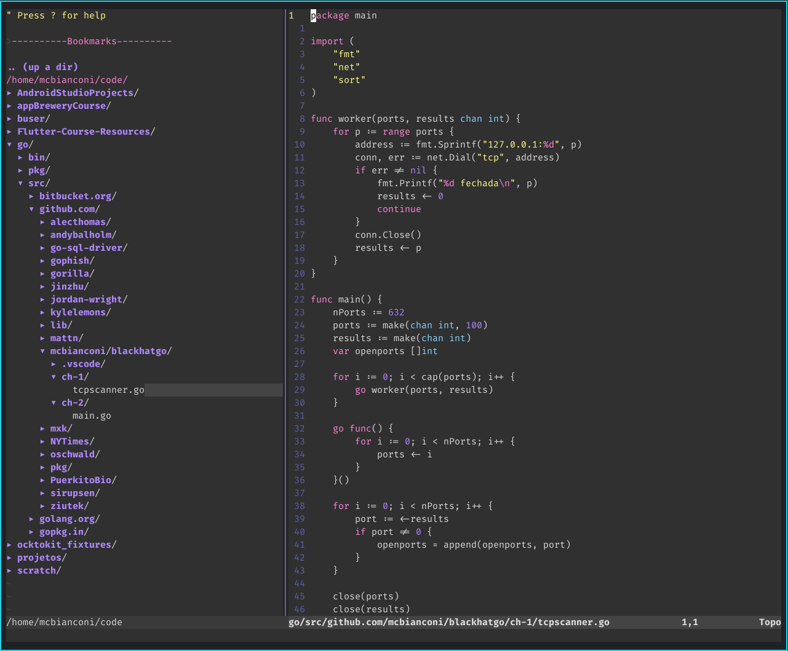
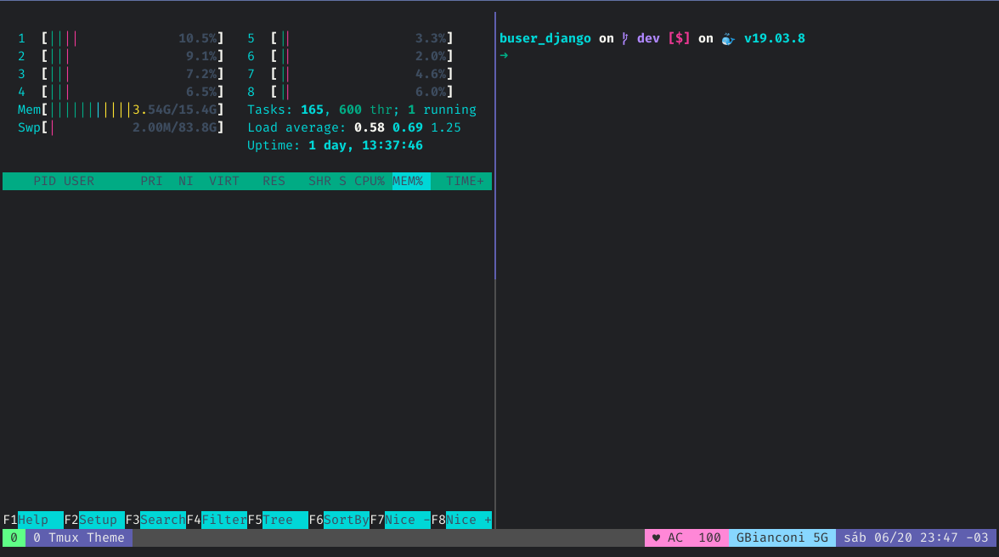
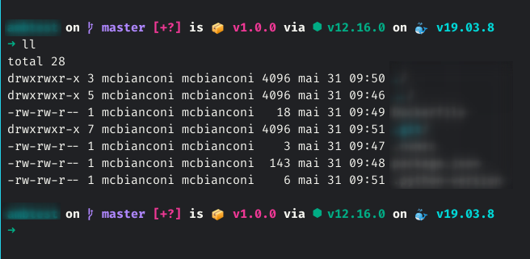
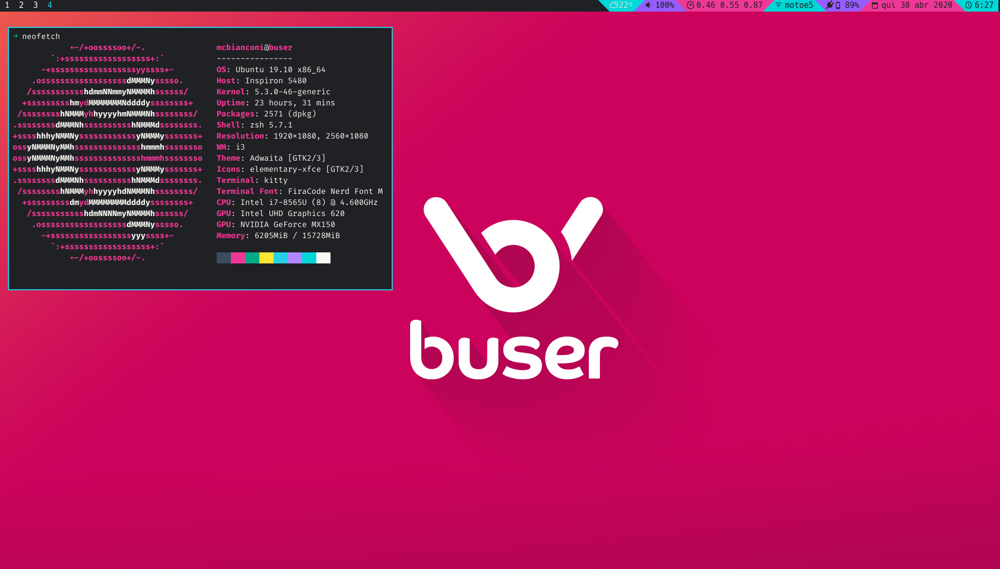
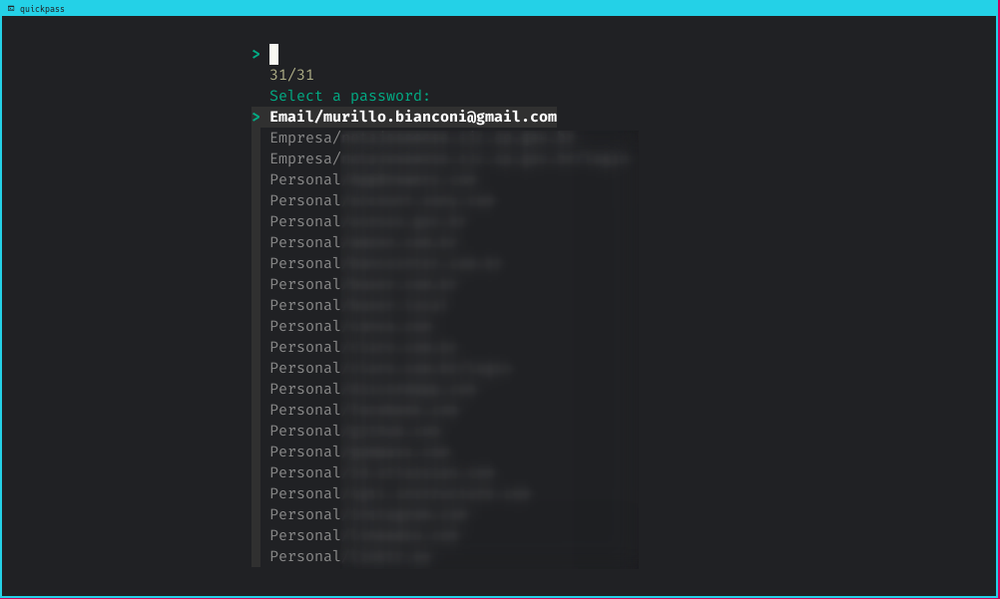

# dotfiles
Dotfiles. Designed to be managed with GNU Stow 

## Usage Instructions
1. Download the repository into **HOME FOLDER** (this step is important because the way `gnu-stow` works!)
```sh
git clone git@github.com:mcbianconi/dotfiles.git $HOME
```
2. Change to dir
```bash
cd $HOME/dotfiles
```
3. Install what you want with gnu-stow, like
```bash
stow i3
stow vim
```
## Note about this repo
This repository is all about my personal config, you may use it at your own risk. Feel free to fork and modify it!

If you like it or want to share some thoughs about it, you can find me on social media as `@mcbianconi` or just [mail me](mailto:murillo.bianconi@gmail.com)

# ScreenshotS

## Vim


## Tmux


## ZSH Minimal prompt


## Workspace and toolbar


## Password Manager script
`Alt+p` shortcupt in i3 config. Check the [script](prod/scripts/quickpass.sh)


